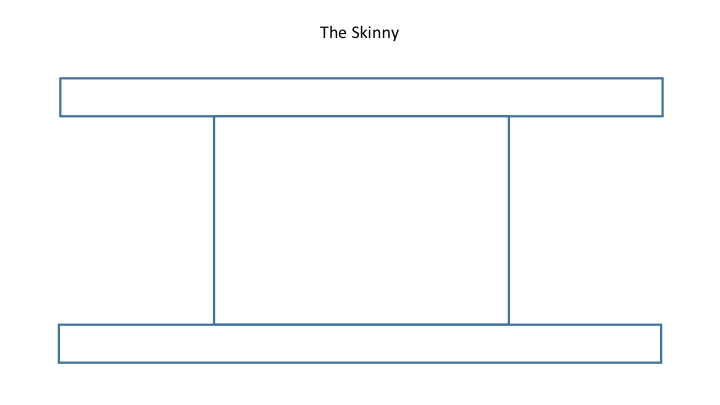
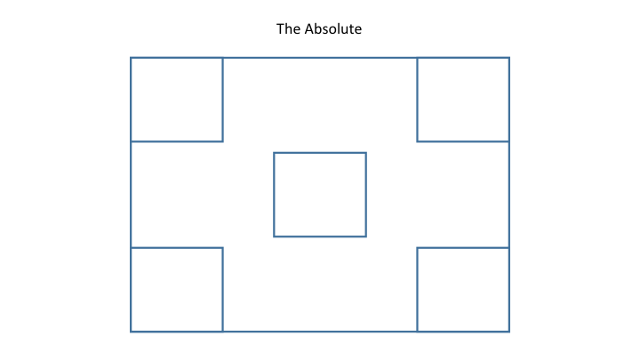

# Nagra HTML, CSS, JS Introduction

##### HTML and CSS
- HTML and CSS work together to create the front end structure and design.
- Front end frameworks and the grid system.

##### Tags:
- Tags allow you to set up your document's structure.
- Attributes allow you to add additional information to a tag.
- Attributes also allow you to bridge the gap between HTML and CSS.

##### Div:
- Divs are like empty rectangles.
- They help organize content on the page.

```html
<div class="margin-top-20 logo">
	My Text Inside
</div>
```

##### Input:
- Inputs allow users to enter data to be saved to a database.
- They come in different forms to facilitate the specific data entry type.

```html
<input type="text" class="form-control" />
```

##### Select list:
- Select lists allow users to select options from a dropdown menu.

```html
<select>
	<option value="USA">United States</option>
</select>
```

##### Button:
- Buttons are HTML elements that give users the ability to submit the data entered as well as transition to new pages.

```html
<button>My Button</button>
```

##### Linking CSS with HTML
- CSS creates the look and feel of the website.
- In order to run external CSS you need to link it to the HTML. This usually goes in the `head` tag:

```html
<link rel="stylesheet" href="css/mystyle.css" />
```

##### Linking JS with HTML
- JavaScript enables interaction with the page.
- In order to run external JS you need to link it to the HTML. This usually goes before the closing `body` tag:

```html
<script src="js/script.js"></script>
```

## HTML Markup Lab
- Open the `html_form` folder and open `index.html`.
- For each comment denoted by `<!-- -->` replace the comment text with the correct HTML as per the instruction to create the form.
- Alter the CSS file to use a Google Fonts font. You will need to use the `font-family` CSS property.
- Bonus: Use CSS to change the background color of the page. Experiment with using images as backgrounds as well.
- Double Bonus: Review the CSS `transition` property documentation and try to create a small animation anywhere on the form. An example may be to highlight a border around a form field when it is clicked.

## New Tags in HTML5
- HTML5 introduced a number of "semantic" tags that give meaning to your markup.
- These new tags play a role in SEO to allow for contextual analysis of content blocks.
- Let's take a look at a list of new semantic tags [here](http://www.w3schools.com/html/html5_new_elements.asp).

## CSS and CSS3 Selectors
- Selectors play a key role in selecting DOM elements for styling.
- There are common selectors that have been around awhile, and also new selectors that give us even more control as of CSS3.
- Let's take a look at some of the most common CSS3 selectors [here](http://www.w3schools.com/cssref/css_selectors.asp).

## Shakespeare's Plays Exercise
- For this exercise we will be using the files [here](shakespeares_plays/).
- Select the `<ul>` with the ID "selected-plays" and place a gray background on it.
- Select the second and third `<h2>` elements (hint: they have classes) and make the font size larger and give them some space below.
- Change the background color of the third column of a table to gray.
- Select the `<li>` elements at the second level of the nested list and change the font color to red.
- Make every other table row in both tables have a gray background.
- Select an anchor tag that has a link to a pdf file. Change the color to blue and increase the font size.
- Select an anchor tag that has an href attribute containing the substring "asyoulikeit" and change the font color to orange.

## Selector Exercise
- Let's use Codepen.io to practice CSS selectors.
- Create at least one div with an id, and four divs with a class.
- Use CSS to apply styling to the divs based on the id and class selectors.
- Bonus: Try implementing one or more styles using a CSS3 selector (first-child, nth-child, first-of-type, etc).

## Floats
- Floating elements allows us to create a nearly unlimited number of layouts using all types of block elements.
- Floating an element essentially removes it from the standard "flow" and places it to the left or right side of its container.
- Elements can have fixed width, which will wrap underneath each other if the container is smaller than the combined widths.
- You can also used percentage width, which will have the columns respond to the screen size.
- You can tell already that the calculations can get out of hand really fast...

## Element Alignment
- To determine how we can align an element we have to first know what kind of element it is.
- Inline elements can be aligned as text, so with the `text-align` CSS property.
- Block elements can be aligned using the space around them - margin. A margin set to auto for both left and right will center the element in a container.

## The Grid Layout
- Most modern layouts operate on a standard 12-column grid system.
- If you break down any of the websites you know and love you will notice many variations on the 12 column grid.
- Each column in the grid can contain nested grids itself.
- If you want a larger box, you need to have a greater column offset.
- Here is a good pictorial to help you break it down:


## Code-Along: Let's Create Our Own Grid
- We will create a 2, 4, and 6 column grid.
- We will try nesting a grid inside another grid.

## CSS Positioning
- There are four main types of positioning that you will see most often - static, relative, absolute, and fixed.
- Static positioning is what all elements have by default. Yay!
- Relative and absolute work together - elements can be positioned absolutely relative to their container.
- Fixed position elements are essentially absolute relative to the window no matter where they are in the DOM. A.K.A. the window is always the relative parent.

## Positioning Exercise
- Try to replicate the following mockups using what we've talked about in this class so far.
- Utilize margins, padding, floats, positioning, etc.

1. Stackers!


2. The Mirror


3. The Skinny



4. The Absolute



## CSS3 Media Queries
- Media queries allow you to apply and remove CSS styling based on the screen dimensions.
- This is important to create truly mobile-friendly layouts.
- To use it you have to specify screen resolution thresholds.
- Let's try an example where we want to show a div where the screen size is larger than 700 pixels:

HTML

```html
<div id="my-div"></div>
```

CSS

```css
@media(min-width: 700px) {
	#my-div {
		width:400px;
		height:400px;
		border:#000 1px solid;
	}
}
```

- Now where the screen size is below 700 pixels:

CSS

```css
@media(max-width: 700px) {
	#my-div {
		width:400px;
		height:400px;
		border:#000 1px solid;
	}
}
```

- You can also combine these values to select a range:

```css
@media(min-width: 700px) and (max-width: 900px) {
	#my-div {
		width:400px;
		height:400px;
		border:#000 1px solid;
	}
}
```

## Why CSS Animation over JavaScript?
- CSS animations are handled by the native browser code.
- This means that instead of JavaScript dynamically changing `style` attributes over a period of time, the animation is performed graphically via the C++ or Java code that runs the browser.
- This produces an animation that is smoother and more robust than anything we can do with JS.

## The `transition` Property
- CSS animations are handled usually by slowly going from one state to another.
- Think of a div for example that upon hover increases its width. A CSS transition essentially makes the process go in slow motion.
- As a result, we can use transitions to animate between many different states.
- Let's take a look at the syntax:

```
transition: property duration easing;
```

- The property here is the specific CSS property you want to animate. This can be a width, height, color, etc.
- If you want to animate across many properties at the same time you can simply specify `all` instead of an actual property name.
- The duration is the length of the animation. It is specified in seconds.
- The easing is the character of the animation. It allows the animation to look more natural by changing its speed of execution dynamically throughout the duration. Here are the allowed values:
	- ease (default)
	- linear
	- ease-in
	- ease-out
	- ease-in-out
	- cubic-bezier(n,n,n,n)

## Transition Fallbacks
- It is also important to note that transitions are relatively new. As a result, certain older browsers may have limited support.
- To reduce the chance of a transition failure, developers normally add "fallbacks" for older browsers.
- These are usually vendor prefixes:

```
transition: width 1s linear;
-webkit-transition: width 1s linear;
-moz-transition: width 1s linear;
-o-transition: width 1s linear;
```

- It is good practice to always put these in when you use transitions.

## The `transform` Property
- Transforms allow you to temporarily change or warp elements to create neat effects.
- Let's take a look at the syntax:

```
transform: transform-function;
```

- This property makes use of transform "functions" that accomplish the effects.
- Here is a list of commonly-used transform functions:
	- translate
	- rotate
	- scale
- A more exhaustive list can be found [here](https://developer.mozilla.org/en-US/docs/Web/CSS/transform).
- Let's say that we wanted to rotate an element upon hover:

```
#my-div {
	width: 200px;
	height: 200px;
	border:#000 1px solid;
	background-color:#900;
}

#my-div:hover {
	transform: rotate(180deg);
}
```

- As you can see, the div rotates instantly. How do you think we can animate the rotation instead?

## CSS Keyframes
- Keyframes allow you to perform complex animations using CSS alone.
- The idea is that instead of transitioning an element from one state to another slowly, you are specifying style attributes that must be accomplished during stops along the animation.
- Here is the syntax:

```
div {
	width:100px;
	height:200px;
	background-color:red;
	-webkit-animation:identifier 5s ease-in-out infinite;
	animation:identifier 5s ease-in-out infinite;
}

@-webkit-keyframes identifier {
	0% {
		top:200px;
	}

	25% {
		top:50px;
	}

	75% {
		left:100px;
	}

	100% {
		top:0;
	}
}

@keyframes identifier {
	0% {
		top:200px;
	}

	25% {
		top:50px;
	}

	75% {
		left:100px;
	}

	100% {
		top:0;
	}
}
```

## Keyframes Exercise
- Try out some of the keyframes along with a transform function.
- One idea may be to rotate a div during a keyframe animation.
- Observe what happens as the div is transformed. Is this what you expected? Why or why not?
- **Bonus:** Now take things a step further and integrate keyframes with JavaScript.
	- Bind a click event to a button that adds a class to the div.
	- Your class should play a keyframe animation of its own.
	- Use at least one transform function in your keyframe.

##Using HTML5 Video
- HTML5 video replaces the need for Flash in browsers that support the new standard.
- It wraps in the standard controls that you are likely to see on a Flash player, with additional features such as responsiveness and a rich API of functions.
- Because of these features, you can do things like [this](http://craftymind.com/factory/html5video/CanvasVideo.html).
- HTML5 video is implemented in the same way as audio in that it has its own tag:

```html
<video controls>
	<source src="sample.ogg" type="video/ogg">
	<source src="sample.mp4" type="video/mp4">
</video>
```

- Note that we can specify multiple formats for browser compatibility.
- Let's try an example with this video: http://vjs.zencdn.net/v/oceans.mp4

##Video.js
- [Video.js](http://www.videojs.com/) is an API for working with HTML5 video.
- The framework wraps in a robust UI to make the video look neat.
- Let's take a look at the [Video.js documentation](https://github.com/videojs/video.js).
- We will try to implement the oceans video now using Video.js.