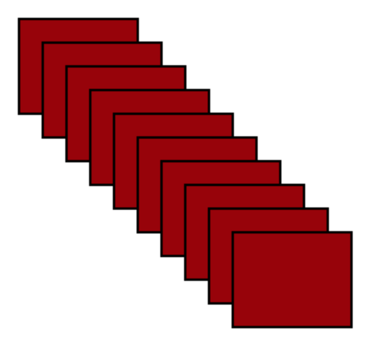

# HTML, CSS, JS Continued

##Introduction to DOM Manipulation
- One of the most powerful features of JS is its ability to alter the DOM.
- You can respond to events on elements, set HTML dynamically, and perform animations.

## Selecting Elements
- Like CSS, if you want to perform some action on an element you first have to select it.
- We did this in CSS through selectors such as IDs, classes, and pseudo-selectors.
- JavaScript gives us an easy way to select elements based on the same paradigm.

#### getElementById()

```javascript
document.getElementById("my-div");
```

#### getElementsByClassName()

```javascript
document.getElementsByClassName("my-div");
```

#### getElementsByTagName()

```javascript
document.getElementsByTagName("my-div");
```

#### querySelector()

```javascript
document.querySelector("#my-div");
```

#### querySelectorAll()

```javascript
document.querySelectorAll("#my-div.my-class");
```

## Dynamically Altering Attributes
- There are many reasons why you may want to alter HTML attributes on the fly with JS.
- Changing inline CSS properties is the most common reason to alter attributes. This can be done with the `style` attribute.
- There are "getter" and "setter" methods available to work with attributes:

Getter

```javascript
div.getAttribute("id");
```
Setter

```javascript
div.setAttribute("style", "background-color: red;");
```

## Dealing with Classes
- In JavaScript you will often need to dynamically change HTML class attributes.
- This may be for animation work or for basic stylistic changes.
- There are a few methods you can use to accomplish this:

Add a class:

```javascript
div.classList.add("anotherclass");
```

Remove a class:

```javascript
div.classList.remove("foo");
```

Toggle a class:

```javascript
div.classList.toggle("visible");
```

Check if element already contains a class:

```javascript
div.classList.contains("foo");
```

## DOM Manipulation Exercise: Shakespeare's Plays
- Download the starter code files [here](shakespeares_plays/).
- Add a class of `special` to all of the `<li>` elements at the second level of the nested list.
- Add a class of `year` to all of the table cells in the third column of a table.
	- Hint: Take a look at how many columns are in each table.
- Make every other table row in both tables have a gray background.
- Select an anchor tag that has a link to a pdf file. Change the color to blue and increase the font size.
- Select an anchor tag that has an href attribute containing the substring "asyoulikeit" and change the font color to orange.

## Handling Events
- There are many events you may want to respond to with JS including clicks, mouseovers, focuses, etc.
- Events can be listened for and responded to using `addEventListener`.

```javascript
document.getElementById("my-div").addEventListener("click", function() {
	alert("Click worked!");
});
```

- If you need to handle an event that occurs on many elements you will need to attach event listeners to each element individually.
- This can be done by binding the event to a class. Let's take this example:

#### index.html

```html
<div class="my-div"></div>
<div class="my-div"></div>
<div class="my-div"></div>
```

#### app.js

```javascript
var myElements = document.getElementsByClassName("my-div");

for (var i = 0; i < myElements.length; i++) {
	myElements[i].addEventListener("click", function() {
		alert("Click worked!");
	});
}
```

## innerHTML
- When you need to replace the HTML inside of an element you can use the `innerHTML` property.

```javascript
document.getElementById("my-div").innerHTML = "<span>New HTML here</span>";
```

## Score Keeper Lab
- We will be creating a simple score keeper application using JavaScript.
- The HTML and CSS has already been done for you [here](score_keeper_html/).
- Here are the steps you should take:
	- Step 1: Add a link to your own custom JS file before the closing body tag.
	- Step 2: Bind click events to the +5 and -5 point buttons and change the innerHTML of the score display appropriately.
	- Step 3: Bind a click event to the set score button and set the innerHTML of the score display to the score entered in the text box.
	- **Bonus:** Create a check in your code to make sure the score will not go negative.
	- **Super Bonus:** Create a function to make the changes to the score display rather than having to write your logic over and over.

## Tic-Tac-Toe Lab
- We will be coding the game of Tic-Tac-Toe from scratch.
- There is so HTML written for you already so you will have to develop your own.
- For the basic requirements don't do any win checking.
- Make sure to account for a space that is already taken.
- **Bonus:** Check for a win and stop the game when a win is detected.

## AJAX
- AJAX is a powerful way to create server requests and get responses without having to reload the page.
- AJAX stands for Asynchronous JavaScript and XML.
- Here is how it can be accomplished:

```javascript
function reqListener () {
	console.log(this.responseText);
}

var oReq = new XMLHttpRequest();
oReq.onload = reqListener;
oReq.open("get", "[Endpoint Here]", true);
oReq.send();
```

- XMLHttpRequest is an object that contains the methods to send AJAX requests.
- The most important method here is `.open`, which takes three parameters:
	- Type of request
	- URL endpoint
	- Asynchronous true or false
- `.send` submits the request.

## AJAX Exercise
- Let's make a request out to `http://daretodiscover.herokuapp.com/users`.
- We can evaluate how we can get data into the console about each user.
- Take this data and create a simple HTML template to insert it into.

## How to Use Handlebars
- Handlebars templates are handled through `<script>` tags, which allow them to be ignored while rendering the page:

```html
<script id="my-template" type="text/x-handlebars-template">
```

- You can write any normal HTML here, but you can also write Handlebars-specific code:

```html
<script id="my-template" type="text/x-handlebars-template">
	<div class="entry">
		<h1>{{title}}</h1>
		<div class="body">
			{{body}}
		</div>
	</div>
</script>
```

- The curly code is essentially keys to a JSON object.
- If you need to, you can also loop through an array of JSON objects to produce very dynamic templates. You will do this today. Here is an example from the docs on how this can be done through helpers:

```html
<h1>Comments</h1>

<div id="comments">
	{{#each comments}}
		<h2><a href="/posts/{{id}}">{{title}}</a></h2>
		<div>{{body}}</div>
	{{/each}}
</div>
```

- This example assumes that `comments` is an array of JSON objects.
- Before a template is used however, it must be first "compiled":

```javascript
var source = document.getElementById("my-template").innerHTML;
var template = Handlebars.compile(source);
```

- The function `Handlebars.compile` returns a function that can be passed JSON data as an argument.
- This resulting function returns HTML after the JSON data is processed into it.
- You can then apply your template anywhere you need to:

```javascript
var jsonData = {
	title: "My New Post",
	body: "This is my first post!"
};

var template_html = template(jsonData);
document.getElementById("some-div").innerHTML = template_html;
```

## Book List with Handlebars
- We will be creating a simple book list system using handlebars to take care of the templating.
- The API for this exercise will be `http://daretodiscover.herokuapp.com/books`.
- The HTML is already done for you [here](book_manager_html/).

## Constructors
- Constructors are JavaScript functions that are responsible for creating objects based on parameters.
- Constructors are similar to classes in other OOP languages.
- Constructors often have "prototype" methods associated with them, which are functions that can access the constructor's scope.

##### Comparison to object literals

```javascript
{
	name: "Arun Sood",
	role: "Instructor",
	username: "arsood",
	email: "arun@ga.co"
}
```

- Let's compare that now to a constructor that accomplishes relatively the same thing:

```javascript
function Person(name, role, username, email) {
	this.name = name;
	this.role = role;
	this.username = username;
	this.email = email;
}
```

- Do you notice any differences?

## Creating an Instance of a Constructor
- Creating an instance of a constructor is accomplished through the `new` keyword:

```javascript
var arun = new Person("Arun Sood", "Instructor", "arsood", "arsood@gmail.com");
```

## Prototypes
- Prototypes allow us to create methods that are attached to our newly-generated objects.
- They usually extend functionality related to that specific "logical concern."
- While thinking about a car, you may do various things with it:

##### Drive it:

```javascript
Car.prototype.drive = function() {
	console.log("We are driving!");
}
```

##### Paint it:

```javascript
Car.prototype.paint = function(newColor) {
	this.color = newColor;
	console.log("Our new color is: " + newColor);
}
```

##### Describe it:

```javascript
Car.prototype.describeCar = function() {
	console.log("We are driving in a " + this.color + " " + this.make + " " + this.model + " that is from the year " + this.year);
}
```

- We can see here that prototypes inherit the scope of their parent constructor.

##### Call a prototype function:

```javascript
var myCar = new Car("Honda", "Civic", 2004, "Red");

myCar.describeCar();
```

## Prototypal Inheritance
- So far we have seen an example of a single-level prototype chain.
- In the wild you will likely see multi-level chains that inherit properties from other "classes."
- Inheritance is usually done in JavaScript via a two-step process:
	1. Set the prototype of the subclass (the class that will get methods and properties from it's parent, which is also known as the superclass) to a new instance of the superclass (also known as parent class).
	2. Set the constructor of the subclass equal to it's constructor function (which was overwritten when the prototype was set to the superclass). For more info on why this is necessary refer to [this](http://stackoverflow.com/questions/8453887/why-is-it-necessary-to-set-the-prototype-constructor) post.
- Let's take an example of a student inheriting from a person class:

```javascript
function Animal (name) {
	this.name = name;
}

Animal.prototype.walk = function () {
	console.log(this.name + ' the ' + this.color + ' ' + this.breed + ' is walking.');
};

function Cat(color, breed, name) {
	this.color = color;
	this.breed = breed;

	Animal.call(this, name);
}

Cat.prototype = new Animal();
Cat.prototype.constructor = Cat;

var myPet = new Cat("Black", "Shorthair", "Maddie");
myPet.walk();
```

## Inheritance Exercise
- Create a constructor function that will construct a plant object with country and isOrganic properties.
- Develop two prototype methods on Plant - showNameandColor and amIOrganic.
- Write a constructor function for a fruit that will contain name and color properties.
- Set the fruit prototype as an instance of a plant.
- Reset the fruit constructor.
- Try calling the showNameandColor as well as the amIOrganic functions on a new instance of a fruit.

##What is jQuery?

jQuery is a cross-browser JavaScript library designed to simplify the client-side scripting of HTML.

It helps us out with:
- DOM traversal
- CSS manipulation through `style` attributes
- Event handling
- Animation
- And much more

## How to Use jQuery
- jQuery is available via CDN at `code.jquery.com`
- You can also download the library and serve it locally
- jQuery by itself is a library of functions. The team has also built additional tools that help us with a variety of things:
	- jQuery UI: A UI tool that adds features such as additional easings, a datepicker, modals, effects, and more.
	- jQuery Mobile: A mobile-optimized framework that allows you to create HTML5 mobile applications that look and act pretty real.

## jQuery Selectors
- The Sizzle selector engine wrapped into jQuery is a powerful tool to help us with manipulating DOM elements.
- The syntax is very similar to CSS:

```javascript
$("#myDiv > ul > li:first-child")
```

- Here the $ sign represents the jQuery library.
- Let's take a look at some of the selectors available to us [here](http://www.w3schools.com/jquery/jquery_ref_selectors.asp).

## jQuery Actions
- Actions almost always follow selectors.
- Actions are jQuery functions that perform an operation on the element(s) selected.
- The format is as follows:

```javascript
$("my-selector").action(options);
```

## DOM Manipulation
- The DOM manipulation functions in jQuery help you accomplish some pretty neat things.
- Here are a few common manipulations you will likely see:

On the fly CSS manipulations:

```javascript
$("my-selector").css("property", "value");
```

On the fly HTML manipulations:

```javascript
$("my-selector").html("New HTML inside here");
```

Altering CSS class attributes:

```javascript
$("my-selector").addClass("new class");

$("my-selector").removeClass("class");

$("my-selector").toggleClass("class");
```

## Event Handling
- Event handling is done very smoothly with jQuery.
- There are a few different ways it can be performed, each having their use cases.
- Let's say we have a button and want to attach an event:

HTML

```html
<button id="my-button">Click Me!</button>
```

jQuery

- This is what I like to call the shortcut method.
- It has the limitation of not working when the DOM element doesn't already exist (think AJAX loading in dynamic content).

```javascript
$("#my-button").click(function() { //Your code here });
```

- You can also bind events using `.on`
- This is also limited to elements that already exist, but it is a better approach.

```javascript
$("#my-button").on("click", function() { //Your code here });
```

- Lastly, you can account for dynamic elements through binding the event to the document itself.
- This also happens to be the most performant if you look at benchmark tests.

```javascript
$(document).on("click", "#my-button", function() { //Your code here });
```

- Here is a list of the most common events you are likely to see:
	- Click
	- Keyup
	- Keydown
	- Mouseenter
	- Mouseleave
	- Dblclick
	- Change

## jQuery Animations
- jQuery wraps in some neat animations that help us achieve some interested effects.
- jQuery animations work by altering the `style` attribute dynamically over a set period of time.
- These animations are great but less performant than CSS3 animations, which are hardware-accelerated.
- Here are a few common animations you will see:

Slide down (show the element):

```javascript
$("my-selector").slideDown();
```

Slide up (hide the element):

```javascript
$("my-selector").slideUp();
```

Slide toggle (back and forth):

```javascript
$("my-selector").slideToggle();
```

Fade in:

```javascript
$("my-selector").fadeIn();
```

Fade out:

```javascript
$("my-selector").fadeOut();
```

Fade toggle (back and forth):

```javascript
$("my-selector").fadeToggle();
```

- Each of these animation functions take three parameters: duration, easing, and callback function to be completed when the animation is complete.

## Custom Animations
- If none of the built-in animations suit you, jQuery also gives you a way to create your own animations.
- This function will dynamically alter the `style` attribute in the HTML document for each property you specify:

```javascript
$("my-selector").animate({
	"margin-top":"200px",
	"margin-left":"+=200px"
}, 600, "swing", function() {
	console.log("I just finished!");
});
```

## Animation Exercise: Gettysburg Address
- Download the exercise files [here](gettysburg_address/).
- Alter the stylesheet to hide the contents of the page initially. When the page is loaded, fade in the contents slowly.
- Give each paragraph a yellow background only when the mouse is over it.
- Make a click of the title (`<h2>`) and simultaneously fade it to 25 percent opacity and grow its left-hand margin to 20px. Then, when this animation is complete, fade the speech text to 50 percent opacity.
- Bonus: Make the style switcher work.
- Challenge: React to presses of the arrow keys by smoothly moving the switcher box 20 pixels in the corresponding direction. The key codes for the arrow keys are: 37 (left), 38 (up), 39 (right), and 40 (down).

## Introduction to Web Sockets
- One of the most powerful uses for Node is its ability to handle seamless "real-time" experiences.
- Sockets are a way for a browser and server to communicate without the standard request-response cycle.
- Chat clients, real-time data feeds, and operational dashboards are some examples of where sockets have been used effectively.

## How it Basically Works
- A client makes an initial request out to the server and a "handshake" is created - AKA a connection has been established.
- This "handshake" is given a unique socket with a unique ID.
- Essentially this request never completes and remains open for the duration of the session.
- Every further request-response simulation is done via a manifestation of a JavaScript event.
- In a perfect world this is how things would always operate with sockets but certain factors such as browser incompatibility and more can interfere with a proper handshake. As a result, a more brute-force approach of "polling" may be required.

## Socket.io
- Socket.io is a library that essentially manages browser capabilities to connect a client with a server through web sockets in the most ideal way possible.
- It can switch between polling and sockets automatically and basically automate the handshake process.
- Socket.io works on the client and the server side to achieve seamless interaction.

## Socket-Based Chat Mechanism

#### The Client Setup
- The client will also use Socket.io to handle the handshake and any further events.
- The first thing that will be needed is to create the handshake with the server:

```javascript
var socket = io.connect("server_url or blank for current server");
```

- The client can also detect and respond to events:

```javascript
socket.on('event', function(params) { });
```

- The client can also "emit" events:

```javascript
socket.emit('event', params);
```

## In-Class Lab: Build the Chat
- In this lab we will be coding working to create a real-time chat application.
- The front end is already done for you [here](chat_starter_app/).
- You will be working in js/app.js to develop the code to interact with the web socket server.
- The server can be found at: http://arunchatserver.herokuapp.com/
- **Bonus:** Use your knowledge of front end JavaScript to change the page title when a new chat is received.

## Introduction to Web Workers
- Web workers add concurrency support for JavaScript.
- With web workers you can accomplish multi-threaded processes with little effort.
- You would generally use a web worker to run a long-running script of some kind that can run in the background.
- Let's see how they work:

##### Setting up a web worker

```javascript
var worker = new Worker("counter.js");
```

##### Responding to worker events
- Workers can trigger events which can be detected.

```javascript
worker.addEventListener("message", function(event) {
	console.log(event.data);
});
```

##### Sending messages from workers (in counter.js)
- Workers can send messages back to the main file.

```javascript
self.postMessage(data);
```

##### Invoking a worker
- Workers need to be started from the main file in order to run.

```javascript
worker.postMessage();
```

## Web Worker Exercise
- In this exercise we will practice web workers by building a simple counter.
- You will create a worker that sets an interval and increases a count by 1 every one second.
- The worker should post the count back to the main file as a message.
- The main file should detect the message and display the new count on the page.

## HTML5 Canvas
- Canvas allows many kinds of image manipulation through JavaScript.
- You can create static images or dynamic scenes.
- Canvas currently only supports 2D scenes but may support 3D scenes in the near future.

## Canvas Exercise: A Simple Drawing
- We will use canvas to draw a simple line and rectangle.
- The final result will look like this:


Step 1: Select the canvas element

```javascript
var canvas = document.getElementById("my-canvas");
```

Step 2: Get the canvas "context"

```javascript
var canvas_context = canvas.getContext("2d");
```

- The context is what you draw on using JavaScript.

Step 3: Fill the rectangle onto the context

```javascript
canvas_context.fillRect(100, 100, 200, 200);
```

Step 4: Create the line

```javascript
canvas_context.beginPath();

canvas_context.moveTo(400, 100);

canvas_context.lineTo(400, 300);

canvas_context.stroke();
```

## Kinetic JS: A Canvas API
- Canvas is not incredibly intuitive to use, and there is quite a lot you can do with it.
- Canvas APIs such as KineticJS, PaperJS, and RaphaelJS are commonly used to maximize the canvas potential.
- We will be practicing using KineticJS to create a scene of rectangles that are draggable:



#### Everything in Kinetic starts with a "stage" that will contain the canvas:

```javascript
var stage = new Kinetic.Stage({
	container:'container',
	width:700,
	height:500
});
```

#### Next we need to create a layer to add elements too:

```javascript
var layer = new Kinetic.Layer();

stage.add(layer);
```

#### Add rectangles to layer:

```javascript
for (var i = 0; i < 10; i++) {
	var rect = new Kinetic.Rect({
		x:10 + (i * 20),
		y:10 + (i * 20),
		width:100,
		height:80,
		fill:"#900",
		draggable:true,
		stroke:"#000000",
		strokeWidth:2
	});

	layer.add(rect);
	layer.draw();
}
```

#### With canvas you can even save the entire stage to JSON to be retrieved at a later time:

```javascript
localStorage.setItem("rectangle_sample", stage.toJSON());
```

#### If you then want to retrieve the JSON and reload the canvas you can do the following:

```javascript
var json = localStorage.getItem("rectangle_sample");
var stage = Kinetic.Node.create(json, 'container');
```

## Canvas Exercise
- In this exercise we will be saving the above example to localStorage and reloading it upon page load.
- Your job is to create a button that the user can use to save the canvas where they want it.
- When the user clicks the button it should save the canvas as JSON in localStorage and retrieve it on page load.